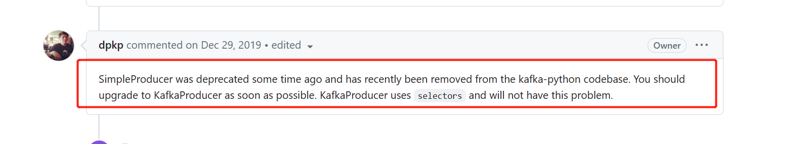

# 引用
1. [我用kafka两年踩过的一些非比寻常的坑](https://cloud.tencent.com/developer/article/1799294)
2. [](https://www.szzdzhp.com/)https://www.szzdzhp.com/
# python-kafka

> 在 python2 下测试 `kafka-python==1.4.7`

安装
 `pip2 install kafka-python==1.4.7`

## 异常

[使用 kafka-python 产生的错误](https://blog.csdn.net/qq_16829085/article/details/108414433)

 `ValueError: filedescriptor out of range in select()`

 [fd 超出 1024 导致的异常1](https://blog.csdn.net/whatday/article/details/113771166)
 [fd 超出 1024 导致的异常2](https://github.com/dpkp/kafka-python/issues/1952)



## 分析

### SimplePorducer

> send_messages接收多个发送消息, 用create_message_set打包成一个messages列表, messages传给ProduceRequestPayload创建一个payloads对象, 用payload对应的broker对payloads分组, 遍历这个分组每个分组发送一次, 用ProduceRequest对payload创建request对象, 用BrokerConnection对象发送request对象, 发送时使用的socket连接, 发送后返回一个future对象, 再用select.select监听这些连接, 当文件描述符超过1024时报错就是这时候发生的.client的创建类为KafkaClient, 基础类为SimpleClent

> 问题, select.select监听文件描述符报错, 文件描述符报错实际是在SimpleClent._send_broker_aware_request中产生, 可能的话可以重写_send_broker_aware_request方法

```python
from kafka import KafkaClient,SimpleProducer
host = '10.8.100.7:9092'
client = KafkaClient(host=host)
producer = SimpleProducer(client=client)
messages = ['messageA','messageB']
topic = 'topic'
producer.send_messages(topic,*messages)
```

### KafkaProducer

> KafkaProducer通过send在代码逻辑上发送发送单条消息, 但是KafkaProducer实现了一个了一个线程, 通过send将消息发送到列表中, 在线程通过消费这个列表, 当消息满足batch_size个字符的数据的发送条件时, 会讲batch_size个字符的数据用socket发送给kafka, 发送完成会将连接放入_sending. 这个线程是一个循环调用run_once方法, 在run_once发送中调用发送逻辑, 发送完成后讲_sending中conn注册到kqueue中, 等待连接回调. 因为KafkaProducer使用的是kqueue, 所以不会碰到和SimpleProducer一样的问题.

后线程的实现类是Sender, kafka连接类是BrokerConnection, kafka client类是client_async. KafkaClient, selector类是vendor/selectors34.py. KqueueSelector

> 问题:kafkaProducer当发送数据比较多时, 发送次数也会多, 当在django中请求比较少时, 发送到列表中数据也少, 发送一个请求发送到kafka中, 可能连续都完成了, 

发送很快, 当请求变多时, 发送到列表中的数据变的无序, 不一定属于那个哪个请求的哪一次kafka发送, 因此会导致请求的数据发送到kafka变慢.

```python
from kafka import KafkaProducer
host = '10.8.100.7:9092'
producer = KafkaProducer(bootstrap_servers=host)
messages = ['messageA','messageB']
topic = 'topic'
for message in messages:
    producer.send(topic,messages)
```

# kafka 消费的坑

[kafka积压类问题](https://juejin.cn/post/7314509615159885875)https://juejin.cn/post/7314509615159885875

## 数据积压问题

在大数据的场景下使用 MQ 一定会遇到数据积压的问题

> Kafka消息积压的问题, 核心原因是生产太快、消费太慢, 处理速度长期失衡, 从而导致消息积压(Lag)的场景, 积压到超过队列长度限制, 就会出现还未被消费的数据产生丢失的场景.

## 重复消费问题
