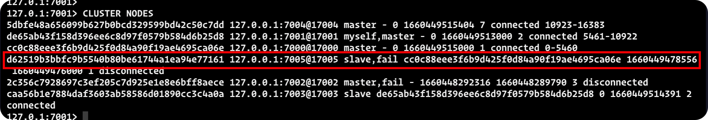

<!-- @import "[TOC]" {cmd="toc" depthFrom=1 depthTo=6 orderedList=false} -->

<!-- code_chunk_output -->

- [一、对集群的初步了解](#一-对集群的初步了解)
- [二、为什么要搭建集群](#二-为什么要搭建集群)
- [三、如何搭建 redis 集群](#三-如何搭建-redis-集群)
  - [1.redis 安装, 查看redis安装路径](#1redis-安装-查看redis安装路径)
  - [2. 集群环境配置](#2-集群环境配置)
- [四、测试](#四-测试)
- [五、知识点](#五-知识点)
- [六、参考](#六-参考)

<!-- /code_chunk_output -->

本篇通过灵魂三问来探究 redis 集群:

* 是什么?
* 为什么?
* 怎么做?

## 一、对集群的初步了解

todo...

## 二、为什么要搭建集群

todo...

## 三、如何搭建 redis 集群

### 1.redis 安装, 查看redis安装路径

* 安装

```shell
brew install redis
```

* redis.conf 路径:/opt/homebrew/etc/redis.conf

ps: 这里路径及查找比较麻烦, 

```
vim /opt/homebrew/Cellar/redis/7.0.4/homebrew.mxcl.redis.plist
```


### 2. 集群环境配置

* mkdir 以下目录, 

```shell
cp /opt/homebrew/etc/redis.conf /usr/local/etc/redis/cluster/7000/7000.conf
```

```
-------------- 修改 7000.conf ，其他文件类似 ----------
port 7000                                     # Redis 节点的端口号
cluster-enabled yes                           # 实例以集群模式运行
cluster-config-file nodes-7000.conf           # 节点配置文件路径
cluster-node-timeout 5000                     # 节点间通信的超时时间
appendonly yes                                # 数据持久化
-----------------------------------------
```

集群目录结构

```
/usr/local/etc
`-- redis
    `-- cluster
        |-- 7000
        |   `-- 7000.conf
        |-- 7001
        |   `-- 7001.conf
        |-- 7002
        |   `-- 7002.conf
        |-- 7003
        |   `-- 7003.conf
        |-- 7004
        |   `-- 7004.conf
        `-- 7005
            `-- 7005.conf
```

启动 redis 的六个节点:

```shell
redis-server /usr/local/etc/redis/cluster/7000/7000.conf &
redis-server /usr/local/etc/redis/cluster/7001/7001.conf &
其他依次顺延
```

查看启动状态:


查看版本号:
1、启动服务端:redis-server
2、启动客户端:redis-cli
3、客户端输入:info

创建集群(redis 5 和redis 7 创建集群的命令不一致, 示例是 redis 7)

```shell
redis-cli --cluster create  --cluster-replicas 1 127.0.0.1:7000 127.0.0.1:7001 127.0.0.1:7002 127.0.0.1:7003 127.0.0.1:7004 127.0.0.1:7005
```


warning: 不要将主从数据库放在同一台机器上, 避免宕机数据丢失
M:master 主节点
S:slave 从节点
三主三从
7000\7001\7002 主节点
7003、7004、7005 从节点

## 四、测试


集群搭建成功

下线一个主节点:


查看节点状态:


这个时间 7002 节点是 fail 状态, 并且 7004 成为了新的 master 节点

下线一个从节点 7005




上线一个从节点 7005

```shell
redis-server /usr/local/etc/redis/cluster/7005/7005.conf &
```


上线一个主节点 7002
这个时候已经有三个主节点了


这个时候 7002 上线成功, 不过成为了 从节点

## 五、知识点

集群节点状态说明

* 主节点
  + 主节点存在hash slots, 且主节点的hash slots 没有交叉
	主节点不能删除

  + 一个主节点可以有多个从节点
  + 主节点宕机时多个副本之间自动选举主节点
* 从节点
  + 从节点没有hash slots
  + 从节点可以删除

## 六、参考

https://segmentfault.com/a/1190000022808576「必看」

http://redisdoc.com/topic/cluster-tutorial.html#id2「必看」

https://blog.csdn.net/qq_43439968/article/details/109882660 

https://zhuanlan.zhihu.com/p/59172042

https://blog.csdn.net/qq_29329241/article/details/113326613
