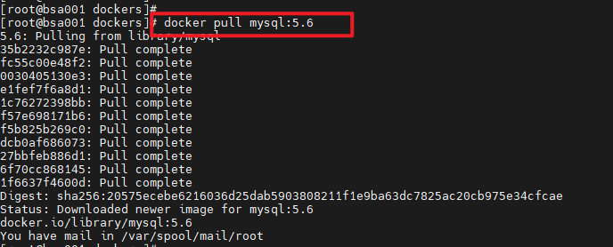
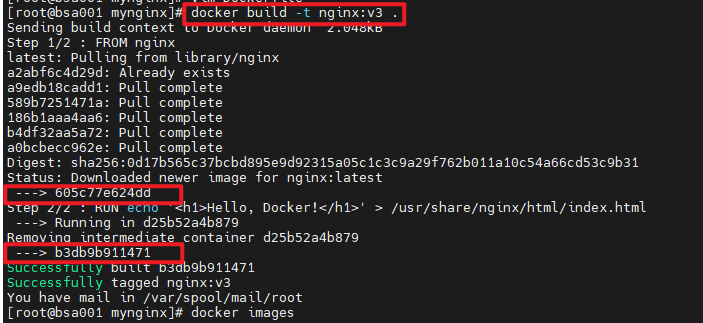

# Docker镜像简单介绍

要知道Docker镜像是怎么一回事, 得先知道Docker是怎么一回事:
Docker 是一个开源的、轻量级的容器引擎, 主要运行于 Linux 和 Windows, 用于创建、管理和编排容器. 为了让应用程序既可以运行在统一主机或者集群, 又能彼此隔离, 虚拟机出现了. 但是虚拟机需要自己的操作系统, 一般体积比较庞大不好维护和升级, 所以容器出现了. 容器目的就是运行应用或者服务, 这意味着容器的镜像中必须包含应用/服务运行所必需的操作系统和应用文件.

ok, 进入主题!

## 到底什么是镜像?

我们都知道操作系统分为内核和用户空间, 对于 Linux 而言, 内核启动后会挂在 root 文件系统为其提供用户空间的支持. 而 Docker 镜像 就相当于一个 root 文件系统, 提供容器运行时所需的程序、库、资源、配置等文件以及运行时的参数(环境变量、用户、数据卷等).

## 镜像是用来干嘛的?

docker 镜像代表了容器的文件系统里的内容, 是容器的基础, 镜像一般是通过 Dockerfile 生成的, 容器是镜像运行时的实体.

## 镜像的构成是怎样的?

在 Docker 的设计上采用了 Union FS 的技术, 分层存储的架构. 所以严格意义上来讲镜像是一个虚拟的概念, 其体现并非由一个文件组成, 而是由一组文件系统组成, 或者说是由多层文件系统联合组成.
简单理解, docker 的镜像是分层的, 所有的镜像(除了基础镜像)都是在之前镜像的基础上加上自己这层的内容生成的.

# Docker镜像使用

## 获取镜像

镜像构建完成后, 我们可以将其上传到仓库中, 供由其他服务器使用. 提供集中存储和分发镜像的服务是 Docker Registry, 官方发布的公开服务地址是 https://hub.docker.com/, 国内也有云服务商发布类似公开的服务, 比如阿里云 https://cn.aliyun.com/product/acr?source=5176.11533457&userCode=8lx5zmtu
除了使用公开服务外, 我们还可以在本地搭建私有的 Docker Registry.

通过命令 docker pull 从仓库获取镜像, 不指定 Docker Registry 默认从 docker hub 拉取镜像. 如图我们以拉取 mysql5.6 镜像为例:

 `docker pull [选项] [Docker Registry 地址[:端口号]/]仓库名[:标签]`

## 查看镜像

使用 docker image ls 命令查看所有已经下载的镜像, 如下图所示可以看到我们下载的 mysql5.6 镜像.

 `docker image ls`

通过 ` docker image ls mysql ` 命令可以查看指定名称的镜像

 `docker image ls mysql`

## 运行镜像

 `docker run --name some-mysql -e MYSQL_ROOT_PASSWORD=my-secret-pw -d mysql:5.6`

查看运行中的容器:
 `docker ps`

进入容器内部:
 `docker exec -it b22754ecb0a9 /bin/bash`

## 删除镜像

 `docker image rm [选项] <镜像1> [<镜像2> ...]`

其中, <镜像> 可以是 镜像短 ID、镜像长 ID、镜像名 或者 镜像摘要等.
像其它可以承接多个实体的命令一样, 可以使用 docker image ls -q  来配合使用 docker image rm, 这样可以成批的删除希望删除的镜像.
 `docker image rm $(docker image ls -q mysql)`

## 定制镜像

镜像构建时, 会一层层构建, 前一层是后一层的基础. 每一层构建完就不会再发生改变, 后一层上的任何改变只发生在自己这一层. 比如, 删除前一层文件的操作, 实际不是真的删除前一层的文件, 而是仅在当前层标记为该文件已删除. 在最终容器运行的时候, 虽然不会看到这个文件, 但是实际上该文件会一直跟随镜像. 因此, 在构建镜像的时候, 需要额外小心, 每一层尽量只包含该层需要添加的东西, 任何额外的东西应该在该层构建结束前清理掉.
镜像的定制实际上就是定制每一层所添加的配置、文件. 如果我们可以把每一层修改、安装、构建、操作的命令都写入一个脚本, 用这个脚本来构建、定制镜像, 那么之前提及的无法重复的问题、镜像构建透明性的问题、体积的问题就都会解决. 这个脚本就是 Dockerfile.

以定制 nginx 镜像为例:

1. 在一个空白目录中，建立一个文本文件，并命名为 Dockerfile
2. Dockerfile 内写入以下内容

`FROM nginx
RUN echo '<h1>Hello, Docker!</h1>' > /usr/share/nginx/html/index.html`

3. 构建 nginx 镜像

 `docker build -t nginx:v3 .`

4. 在 9529 端口运行 nginx 镜像

 `docker run --name webserver -d -p 9529:80 nginx:v3`

5. 开放 9529 端口可以被外部访问

 `iptables -I INPUT -p tcp --dport 9529 -j ACCEPT;`

6. 浏览器访问该地址，得到返回 “Hello, Docker!”

在示例中, 我们编写的 Dockerfile 文件很简单, 只有两条指令::

* FROM nginx ——> 指定基础镜像, 定制镜像一定是以一个镜像为基础, 在其上进行定制. 在 Dockerfile 中 FROM 是必备的指令.
* RUN xxx ——> RUN 指令用来执行命令行命令.

从对下图的分析诠释在 Dockerfile 中, 每一个指令都会建立一层的概念:
在 step1 中 FROM 指定拉取仓库中的 nginx 并提交了最新的一层 605c77e624dd.
在 step2 中 RUN 指令 开启了容器 d25b52a4b879 , 执行了 echo 的命令将银行中的内容覆盖输出到 nginx 目录下的 index.html 文件中, 然后删除了该容器 d25b52a4b879, 并最后提交了一层  b3db9b911471 .

## 构建镜像的其他方式

除却使用 Dockerfile 生成镜像的方式, 我们还可以通过其他方式构建:
1. 从 rootfs 压缩包导入。

 `docker import [选项] <文件>|<URL>|- [<仓库名>[:<标签>]]`

压缩包可以是本地文件、远程 Web 文件, 甚至是从标准输入中得到. 压缩包将会在镜像目录展开, 并直接作为镜像第一层提交.

2. 将构建好的 docker 镜像直接导入导出

docker 提供了 docker save 和 docker load 命令, 用以将镜像保存为一个文件, 然后传输到另一个位置上, 再进行加载.

 `docker save nginx:v3 | gzip > nginx-v3.tar.gz`
